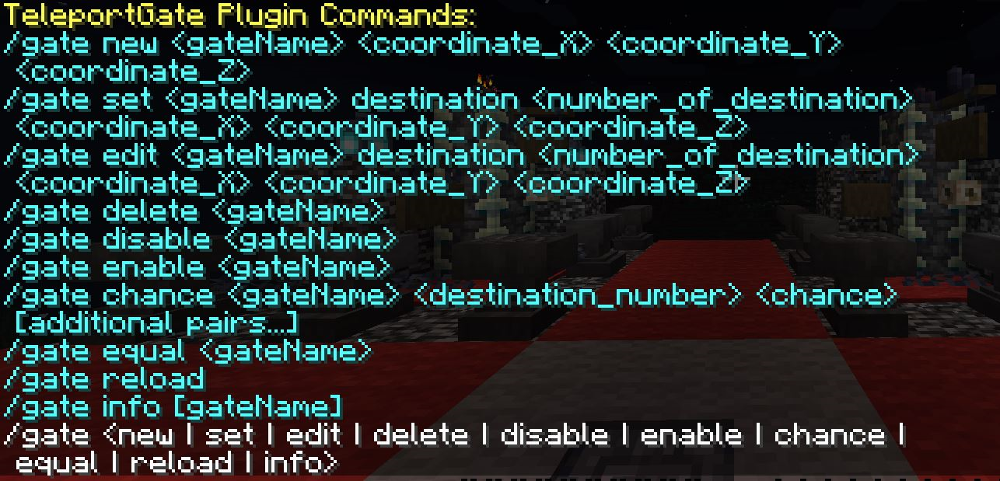

# TeleportGate Plugin

A Minecraft plugin for the Paper server (version 1.20.6) that allows players to create and manage teleportation gates with various modes and destinations.

## Features

- Create teleportation gates with random or manual destination selection.
- Set chances for each destination.
- Enable or disable gates.
- Configure timers for gates to open and close automatically.
- Customize destination names and items.
- Admin commands for managing gates.

## Installation

1. Download the latest release of the plugin from the [Releases](https://github.com/kaveh2k/teleportgate/releases) page.
2. Place the downloaded `.jar` file into the `plugins` directory of your Paper server.
3. Start or restart your server to load the plugin.
4. The plugin will generate a default configuration file in the `plugins/TeleportGate` directory.

## Configuration

The configuration file (`config.yml`) allows you to set up gates, destinations, chances, and timers. Here is an example configuration:

```yaml
world: world
gates:
  exampleGate:
    location:
      world: world
      x: 100
      y: 64
      z: 100
      pitch: 0
      yaw: 0
    mode: random
    destinations:
      1:
        world: world
        x: 200
        y: 64
        z: 200
        pitch: 0
        yaw: 0
    chances:
      1: 100
    disabled: false
    timer_mode: none
    countdown_time: 0
    open_time: 0
    destination_names:
      1: "Example Destination"
    destination_items:
      1: "ENDER_PEARL"
```

## Commands

### Admin Commands



- `/gate new <gateName> <coordinate_X> <coordinate_Y> <coordinate_Z>`: Create a new gate.
- `/gate set <gateName> destination <number_of_destination> <coordinate_X> <coordinate_Y> <coordinate_Z>`: Set a destination for a gate.
- `/gate edit <gateName> destinationname <number_of_destination> <new_name>`: Edit the name of a destination.
- `/gate edit <gateName> destinationitem <number_of_destination> <item_name>`: Edit the item of a destination.
- `/gate edit <gateName> destination <number_of_destination> <coordinate_X> <coordinate_Y> <coordinate_Z>`: Edit a destination's coordinates.
- `/gate delete <gateName>`: Delete a gate.
- `/gate disable <gateName>`: Disable a gate.
- `/gate enable <gateName>`: Enable a gate.
- `/gate chance <gateName> <destination_number> <chance> [additional pairs...]`: Set chances for destinations.
- `/gate equal <gateName>`: Set equal chances for all destinations.
- `/gate mode <gateName> <random | manual>`: Set the mode of a gate.
- `/gate timer <gateName> <loop | one-time | permanent> <countdown_time> <open_time>`: Set a timer for a gate.
- `/gate enabletimer <gateName>`: Enable the timer for a gate.
- `/gate disabletimer <gateName>`: Disable the timer for a gate.
- `/gate edittimer <gateName> <loop | one-time | permanent> <countdown_time> [<open_time>]`: Edit the timer for a gate.
- `/gate settimertext <gateName> <type> <text>`: Set the timer text for a gate.
- `/gate reload`: Reload the plugin configuration.
- `/gate info [gateName]`: Get information about gates.

## Permissions

- `teleportgate.admin`: Allows access to all admin commands.

## License

This project is licensed under the MIT License. See the [LICENSE](LICENSE) file for details.

## Contributing

Contributions are welcome! Please open an issue or submit a pull request on GitHub.

## Contact

For support or inquiries, please contact [kaveh.au@protonmail.com](mailto:kaveh.au@protonmail.com).
